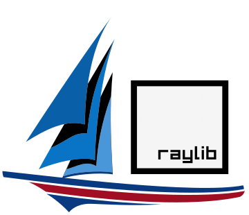
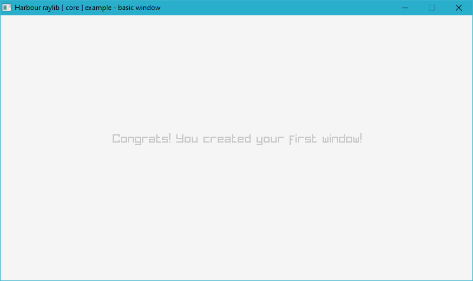

# **Harbour project extended xBase compiler**

**hb-raylib v3.7** is a cross-platform open-source software development library. The library is meant to create graphical applications and games. The source code is written in C Language. It supports compilation to many target platforms, including Windows, GNU Linux, macOS, FreeBSD, Android.

View the project on [GitHub](https://github.com/rjopek/hb-raylib)

### Function reference v3.7

> - [module: audio](audio "module: audio")
> - [module: core](core "module: core")
> - [module: models](models "module: models")
> - [module: shapes](shapes "module: shapes")
> - [module: text](text "module: text")
> - [module: textures](textures "module: textures")
> - [colors](colors "colors")
> - [structs](structs "structs")

### Example code



#include "hbraylib.ch"

PROCEDURE Main()

   LOCAL nScreenWidth := 800
   LOCAL nScreenHeight := 450

   InitWindow( nScreenWidth, nScreenHeight, "Harbour raylib [ core ] example - basic window" )

   SetTargetFPS( 60 )

   DO WHILE ! WindowShouldClose()

      BeginDrawing()

         ClearBackground( RAYWHITE )

         DrawText( "Congrats! You created your first window!", 190, 200, 20, LIGHTGRAY )

      EndDrawing()

   ENDDO

   CloseWindow()

   RETURN



This site is based on the original [RayLib v3.7](https://www.raylib.com/cheatsheet/cheatsheet.html) documentation.

License MIT is obviously applied only for this repository, not what it builds.

&copy; 2020 - 2021 Rafał Jopek

 
 
 
